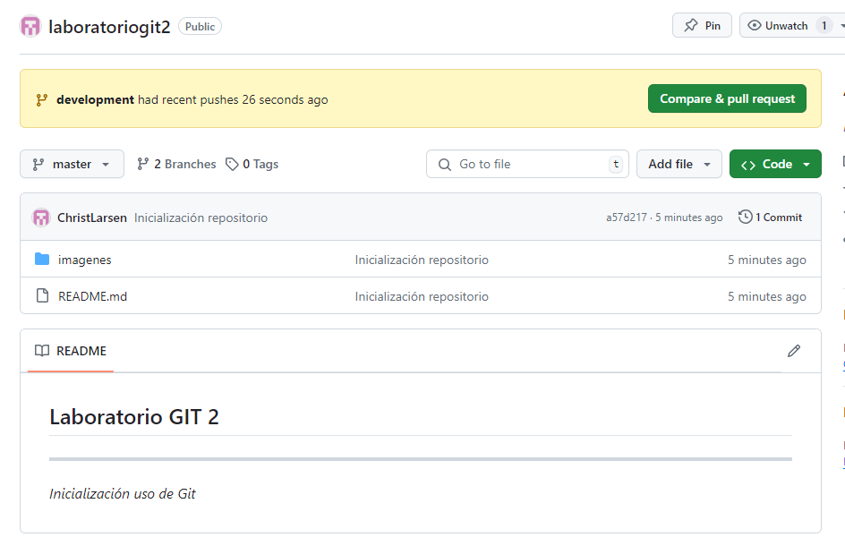

## Laboratorio GIT 2

---

_Inicialización uso de Git_

1. Crear un repositorio en local

**mkdir laboratoriogit2**

**cd laboratoriogit2**

**git init**

2. Subir el repositorio a GitHub

**git remote add origin https://github.com/ChristLarsen/laboratoriogit2.git**

3. Hacer un commit y un push

He abierto mi repositorio nuevo con VSCode. Creo un nuevo fichero README.md :

**git add .**

**git commit -m "Inicialización repositorio"**

**git push --set-upstream origin master**

4. Crear una rama

**git branch development**

**git checkout development**

Creo ficheo fichero1.js en mi carpeta principal.

**git add .**

**git commit -am "Development"**

**git push -set-upstream origin development**

5. Hago un merge

**git checkout master**

**git merge development -m "Merge con development"**

**git push**

